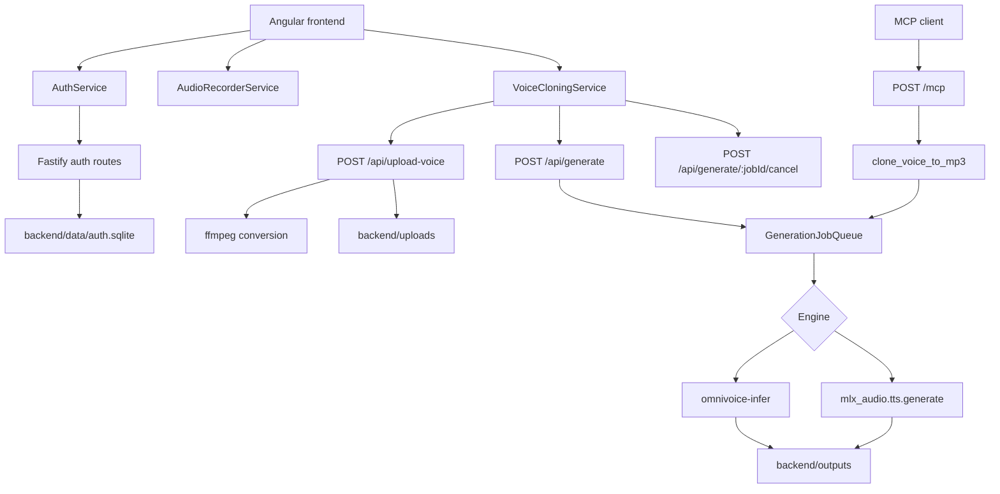

# Architecture

## System Overview

VoiceCloning is a local voice cloning studio made of an Angular frontend and a Fastify backend. The user logs in, records or selects a reference voice sample, uploads it to the backend, chooses a synthesis engine, submits text, and receives generated audio. The backend also exposes the same generation capability to agents through a Streamable HTTP MCP endpoint.

The runtime is a two-layer web application. The frontend handles browser audio capture, local saved voice metadata, theme state, authentication state, and playback. The backend handles authentication, upload conversion, queued inference, output conversion, static production serving, and MCP tool execution. Voice sample and output files are stored under the backend directory, while authentication users, sessions, and generated MCP auth settings are stored in SQLite.

## Component Diagram



## Technology Stack

| Category | Technology | Purpose |
|----------|------------|---------|
| Frontend framework | Angular 19 | Standalone application, signals, forms, HTTP client, browser UI |
| Frontend styling | Bootstrap 5 and SCSS | Layout, responsive styling, and app-specific visual design |
| Frontend audio | MediaRecorder and getUserMedia | Browser microphone capture and preview blobs |
| Backend runtime | Node.js with ES modules | Fastify server and child process orchestration |
| Backend framework | Fastify 5 | HTTP API, CORS, multipart upload, static file serving |
| Auth storage | SQLite via `node:sqlite` | Local users, sessions, and auth settings |
| Authentication | PBKDF2 password hashes and HS256 JWT | User login, bearer auth, session persistence, MCP token auth |
| Agent integration | Model Context Protocol SDK | Streamable HTTP MCP endpoint and `clone_voice_to_mp3` tool |
| Audio conversion | ffmpeg | Convert uploads to mono 16 kHz WAV and outputs to WebM or MP3 |
| Inference engines | OmniVoice and MLX/Qwen | Generate cloned speech from a reference voice and target text |
| Package manager | npm | Frontend and backend dependency management |

## Design Decisions

### Decision 1: Separate Angular UI from Fastify backend

- Decision: Keep UI concerns in `frontend/` and server, auth, inference, and storage concerns in `backend/`.
- Rationale: Browser APIs are isolated from server-side filesystem, SQLite, and child process execution.
- Alternatives considered: A single server-rendered application or a backend-only API.
- Consequences: Development uses two processes with an Angular proxy. Production can use one backend process after building the frontend.

### Decision 2: Local SQLite authentication

- Decision: Store users, sessions, JWT secret fallback, and MCP auth token in `backend/data/auth.sqlite`.
- Rationale: The app is designed for local or private deployment and does not require an external identity provider.
- Alternatives considered: Stateless-only JWTs or a hosted database.
- Consequences: Operators must protect the SQLite database. Revoked sessions can be enforced server-side.

### Decision 3: Convert all references to WAV before inference

- Decision: Uploaded and MCP-provided audio samples are converted to mono 16 kHz WAV before inference.
- Rationale: Inference engines receive a predictable audio format regardless of browser or client upload format.
- Alternatives considered: Passing original user audio directly to each engine.
- Consequences: ffmpeg is a required runtime dependency and upload conversion errors are user-facing.

### Decision 4: Serialize generation through a job queue

- Decision: Use `GenerationJobQueue` with one active job and an in-memory queued job list.
- Rationale: Local inference is expensive and should avoid uncontrolled concurrent engine processes.
- Alternatives considered: Run every request immediately or use an external queue.
- Consequences: Jobs can be cancelled while queued or active, but queue state is process-local and not durable across restarts.

### Decision 5: Reuse generation logic for HTTP and MCP

- Decision: Both `/api/generate` and MCP `clone_voice_to_mp3` call `generateClonedAudio` through the generation queue.
- Rationale: HTTP and agent workflows share validation, engine selection, conversion, and cancellation behavior.
- Alternatives considered: Separate MCP-only implementation.
- Consequences: UI output is WebM while MCP output is MP3, but core synthesis behavior stays aligned.

## Directory Structure

```text
VoiceCloning/
  README.md                         # Existing project overview and setup notes
  backend/
    package.json                    # Backend scripts and dependencies
    server.js                       # Fastify app, auth, upload, generation, MCP, static serving
    scripts/
      users.js                      # Local user administration CLI
    data/                           # SQLite auth database at runtime
    uploads/                        # Uploaded originals and converted reference WAV files
    outputs/                        # Generated WAV, WebM, and MP3 files
  frontend/
    package.json                    # Angular scripts and dependencies
    angular.json                    # Angular build, serve, assets, Bootstrap, and Karma config
    proxy.conf.json                 # Dev proxy from Angular to backend port 17992
    public/                         # PWA assets and service worker
    src/
      app/
        app.component.ts            # Main UI state and workflows
        app.component.html          # Login, capture, library, generation, result UI
        app.component.scss          # Component styling
        app.config.ts               # Angular providers
        audio-recorder.service.ts   # Browser microphone recording
        auth.service.ts             # Login, logout, session refresh, bearer headers
        voice-cloning.service.ts    # HTTP client for upload, generate, cancel
      main.ts                       # Angular bootstrap
      styles.scss                   # Global styles
    dist/                           # Production build output when present
```

## Data Flow

### Login and session refresh

1. The user submits credentials in the Angular login form.
2. `AuthService.login` posts to `/api/auth/login`.
3. The backend verifies the PBKDF2 password hash, creates a session row, signs a JWT, and returns user data.
4. The frontend stores the bearer token in browser local storage and uses it for API calls.
5. On startup, `AuthService.refreshSession` calls `/api/auth/me`; invalid or expired sessions clear local state.

### Browser voice generation

1. `AudioRecorderService` requests microphone access and captures audio with MediaRecorder.
2. `AppComponent.toggleRecording` stops recording, creates a preview blob, and uploads the sample.
3. `VoiceCloningService.uploadVoice` posts multipart field `audio` and `language` to `/api/upload-voice`.
4. The backend stores the original upload, converts it to WAV with ffmpeg, and returns a `voiceId`.
5. The user selects an engine and output language, enters text, and clicks Generate.
6. `VoiceCloningService.generate` posts `jobId`, `voiceId`, `text`, `language`, and `engine` to `/api/generate`.
7. The backend validates the job and reference WAV, queues generation, runs OmniVoice or MLX/Qwen, converts WAV output to WebM/Opus, and returns the audio blob with generation metadata headers.
8. The frontend creates an object URL, displays the audio player, and exposes a download link.

### MCP voice generation

1. An MCP client sends a Streamable HTTP request to `/mcp` with bearer authentication.
2. The backend creates a per-request MCP server and registers `clone_voice_to_mp3`.
3. The tool decodes base64 audio, stores and converts the reference sample, queues generation, and returns MP3 audio content plus JSON metadata.
