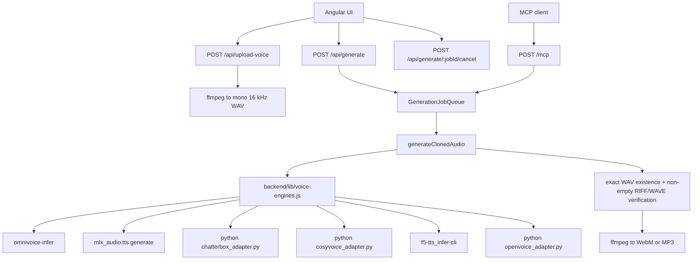

# Architecture

## System overview

VoiceCloning is a two-process web app in development and a single-process app in production-style local deployments:

- Angular frontend for login, recording, saved voices, engine selection, cancellation, playback, and download.
- Fastify backend for auth, uploads, queueing, inference orchestration, static serving, and MCP.

The backend still owns the queue, cancellation, input conversion, and output conversion pipeline. HTTP and MCP both call the same `generateClonedAudio` function.

## Core backend flow



## Engine architecture

Canonical engine IDs:

- `omnivoice`
- `mlx-qwen`
- `chatterbox`
- `cosyvoice`
- `f5-tts`
- `openvoice`

`backend/lib/voice-engines.js` centralizes:

- engine metadata used by `/api/health`
- alias normalization for HTTP requests
- language normalization for `en`, `fr`, `es`
- per-engine Conda env, repo path, and model/checkpoint path resolution
- argv construction for safe `spawn(cmd, args)` execution

Python adapters exist only where the upstream engine is primarily a Python API:

- `chatterbox_adapter.py`
- `cosyvoice_adapter.py`
- `openvoice_adapter.py`

F5-TTS uses its supported CLI directly. OmniVoice and MLX/Qwen keep their previous command paths.

## Directory structure

```text
backend/
  server.js
  lib/
    voice-engines.js
  inference/
    common.py
    chatterbox_adapter.py
    cosyvoice_adapter.py
    openvoice_adapter.py
  test/
    voice-engines.test.js
frontend/
  src/app/
    app.component.ts
    app.component.html
    app.component.scss
    voice-cloning.service.ts
```

## Design decisions

### Shared generation path

- Decision: HTTP and MCP keep sharing `generateClonedAudio`.
- Reason: output format differs by caller, but validation, queueing, engine selection, and cancellation must stay aligned.

### Safe child process execution

- Decision: every engine is executed with `spawn(cmd, args)` and never through a shell.
- Reason: request text and paths must not be shell-expanded.

### Exact WAV verification

- Decision: the backend verifies that each engine created the expected WAV file, that it is non-empty, and that it starts with `RIFF`/`WAVE`.
- Reason: several upstream tools succeed noisily or write to surprising paths; the backend now treats that as a hard error.

### Per-engine isolation

- Decision: each engine has its own configurable Conda env plus repo/model/checkpoint settings.
- Reason: the Python stacks are incompatible enough that one shared environment is fragile.

### UI stays contract-compatible

- Decision: the frontend request body remains `jobId`, `voiceId`, `text`, `language`, and `engine`.
- Reason: new engines should not require a browser contract change or extra transcript fields.
